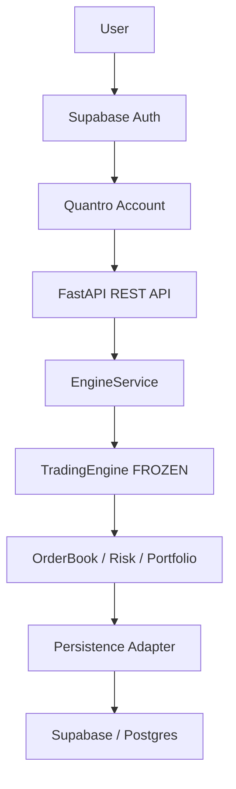

# Quantro Phase Status and Verification Report

Inspection date: 2026-08-26

## 1. Executive Summary

Quantro is a deterministic sandbox trading system. Its core is a Python trading engine that models accounts, fixed-point balances, markets, orders, order-book matching, risk checks, portfolio accounting, trades, positions, and P&L. The current repository state contains the Phase 1 deterministic trading core, the Phase 2A FastAPI REST adapter, and the current Phase 2B Supabase Auth plus Postgres persistence implementation.

Current phase: Phase 2B.

Overall architecture: a frozen deterministic core under `src/quantro/` is wrapped by `src/quantro_api/`. The API owns request validation, HTTP serialization, account ownership checks, authentication integration, process-local engine state, and optional Postgres persistence. Phase 2B adds Supabase Auth calls, Auth user to Quantro account linking, sandbox initial funds, and restart/rehydration through persisted engine state.

Current verified status:

| Area | Status | Evidence |
|---|---:|---|
| Phase 1 deterministic trading core | TEST-VERIFIED | `venv/bin/pytest -q tests/test_fixedpoint.py tests/test_orderbook.py tests/test_portfolio.py tests/test_risk.py tests/test_integration.py`: 139 passed |
| Phase 2A REST API | TEST-VERIFIED | `venv/bin/pytest -q tests/test_api.py`: API lifecycle/error/cancellation tests included in 4 passed |
| Phase 2B auth/persistence implementation | TEST-VERIFIED with mocks/in-memory restart store | `tests/test_api.py::test_authenticated_sandbox_journey_persists_across_restart`: included in 4 passed |
| Live Supabase signup/login/trading/rehydration | BLOCKED/PENDING | Not run in this reporting pass by instruction; latest known live Auth attempt failed before signup on hostname/DNS connectivity |

The full current suite result from the repository-local virtual environment is:

`143 passed, 0 failed, 0 skipped` (`venv/bin/pytest -q`).

## 2. Phase 1 - Deterministic Trading Core

Phase 1 is implemented in `src/quantro/` and is treated as frozen for this report.

| Component | Status | Purpose |
|---|---:|---|
| `TradingEngine` | TEST-VERIFIED | Integrates markets, accounts, risk validation, fund locking, order-book execution, fills, portfolio updates, cancellation, snapshots, and event logging. |
| `Market` | TEST-VERIFIED | Defines tradable symbol metadata, base/quote assets, precision, lot/tick sizes, fees, activity, and order-size limits. |
| `Order` | TEST-VERIFIED | Immutable order lifecycle object with pending/open/partially-filled/filled/cancelled/rejected states. |
| `OrderBook` | TEST-VERIFIED | Deterministic price-time priority matching engine with bids, asks, FIFO price levels, depth, market/limit execution, partial fills, FOK/IOC handling, cancellation, and snapshots. |
| `RiskEngine` | TEST-VERIFIED | Performs deterministic pre-trade checks for order size, balances, position limits, exposure, leverage, short-selling permission, open-order count, market limits, and order validity. |
| `Portfolio` / `PortfolioManager` | TEST-VERIFIED | Tracks balances, locked funds, open-order counts, positions, trade history, realized/unrealized P&L, snapshots, deposits, and withdrawals. |
| Fixed-point arithmetic | TEST-VERIFIED | `FixedPoint` provides deterministic numeric behavior and string-safe financial values. |

Phase 1 behaviors covered:

| Behavior | Status |
|---|---:|
| Balances: free, locked, total | TEST-VERIFIED |
| Positions: long, short, flat transitions | TEST-VERIFIED |
| Realized and unrealized P&L | TEST-VERIFIED |
| Trades/fills with maker/taker fees | TEST-VERIFIED |
| Trade history by order and symbol | TEST-VERIFIED |
| Deterministic replay/snapshot equivalence | TEST-VERIFIED |
| End-to-end integration lifecycle | TEST-VERIFIED |

Major Phase 1 bugs discovered and fixed, based on current implementation and test coverage:

| Bug/fix area | Current status | Verification evidence |
|---|---:|---|
| Leverage/equity mark-price key mismatch | TEST-VERIFIED | `tests/test_risk.py::TestRiskEngineLeverageLimits::test_leverage_within_limit` uses asset-keyed mark prices for equity calculation. |
| Maker locked-fund settlement | TEST-VERIFIED | Integration/API lifecycle tests verify maker fill settlement and zero locked funds after completed match. |
| Portfolio truthiness issue caused by `__len__` | TEST-VERIFIED | Engine uses explicit `portfolio is None` checks rather than truthiness; tests exercise newly created portfolios with zero trade history. |
| Maker partial-fill fund unlocking | TEST-VERIFIED | `tests/test_integration.py::test_partial_fill_resting_buy_keeps_remaining_locked_and_active` verifies filled funds unlock for settlement while remaining funds stay locked. |
| `open_orders_count` handling | TEST-VERIFIED | Portfolio and integration tests verify increment/decrement and no underflow on fills/cancellations. |
| Submitter portfolio overwrite issue | TEST-VERIFIED | Matching lifecycle tests verify submitter balances, positions, and trade history survive post-trade state updates. |
| Cancellation fund-unlocking issue | TEST-VERIFIED | Core, integration, and API cancellation tests verify cancelled open orders unlock funds and leave the order book empty. |

Verified Phase 1 result:

`139 collected / 139 passed / 0 failed / 0 skipped`.

## 3. Phase 1 Integration Verification

The integration suite covers the complete lifecycle:

`account creation -> deterministic balances -> BUY -> risk validation -> fund locking -> order-book insertion -> SELL -> matching -> fills/trades -> balance updates -> positions -> P&L -> trade history -> final order states -> final order-book state`

Repository evidence:

| Lifecycle step | Status | Test evidence |
|---|---:|---|
| Account creation and deterministic initial balances | TEST-VERIFIED | `test_account_creation_and_deposit` |
| BUY limit submission | TEST-VERIFIED | `test_buy_order_submission_risk_validation_and_locking` |
| Risk validation | TEST-VERIFIED | BUY/SELL lifecycle tests assert `risk_report.passed is True`; rejection tests assert failed checks. |
| Fund locking | TEST-VERIFIED | BUY locks quote plus fee; SELL locks base quantity. |
| Order-book insertion | TEST-VERIFIED | Resting BUY appears as best bid with correct remaining quantity. |
| SELL submission and matching | TEST-VERIFIED | `test_sell_order_submission_risk_validation_and_matching` |
| Fills/trades | TEST-VERIFIED | Matching produces maker and taker trades with expected quantity, price, notional, and fee behavior. |
| Balance updates | TEST-VERIFIED | `test_balance_updates_after_fill` and API lifecycle assertions. |
| Positions | TEST-VERIFIED | `test_position_updates_after_fill` verifies long/short position creation. |
| P&L | TEST-VERIFIED | `test_realized_unrealized_pnl_after_fill` and P&L API assertions. |
| Trade history | TEST-VERIFIED | `test_trade_history_recorded`; API account trades endpoint. |
| Final order states | TEST-VERIFIED | `test_final_order_statuses_filled` |
| Final order-book state | TEST-VERIFIED | `test_final_order_book_state_empty` |

Additional integration coverage:

| Scenario | Status |
|---|---:|
| Partial fills | TEST-VERIFIED |
| Cancellation and fund unlocking | TEST-VERIFIED |
| Insufficient balance rejection | TEST-VERIFIED |
| Maximum order size rejection | TEST-VERIFIED |
| Deterministic replay/snapshot equivalence | TEST-VERIFIED |

## 4. Phase 2A - REST API

Phase 2A is implemented in `src/quantro_api/app.py`, `service.py`, `schemas.py`, and `serializers.py`. It is an adapter-layer design: HTTP requests are validated by Pydantic, transformed into core `quantro` domain objects, submitted to a shared `EngineService`, and serialized back to JSON with financial values returned as strings.

Implemented endpoints:

| Endpoint | Status | Purpose |
|---|---:|---|
| `POST /accounts` | TEST-VERIFIED | Create an unauthenticated sandbox account when auth is disabled; returns the authenticated linked account when auth is enabled. |
| `POST /accounts/{account_id}/deposit` | TEST-VERIFIED | Deposit funds into an account; protected by ownership checks when auth is enabled. |
| `GET /markets` | TEST-VERIFIED | List configured markets; default market is `BTC-USD`. |
| `GET /markets/{symbol}/orderbook` | TEST-VERIFIED | Return public order-book depth, best bid/ask, spread, mid, and last trade data. |
| `POST /orders` | TEST-VERIFIED | Submit orders through risk validation and engine matching. |
| `GET /orders/{order_id}` | TEST-VERIFIED | Retrieve indexed order state. |
| `DELETE /orders/{order_id}` | TEST-VERIFIED | Cancel open orders and unlock funds; rejects invalid cancellation. |
| `GET /accounts/{account_id}/orders` | TEST-VERIFIED | List account orders from API order indexes. |
| `GET /accounts/{account_id}/trades` | TEST-VERIFIED | List account trades from API trade indexes. |
| `GET /accounts/{account_id}/balances` | TEST-VERIFIED | Return account balances as string-safe financial values. |
| `GET /accounts/{account_id}/positions` | TEST-VERIFIED | Return current account positions. |
| `GET /accounts/{account_id}/pnl` | TEST-VERIFIED | Return realized, unrealized, and total P&L. |
| `/auth/signup` | TEST-VERIFIED with fake Auth client; not live-verified | Create Supabase Auth session response and linked Quantro account. |
| `/auth/login` | TEST-VERIFIED with fake Auth client; not live-verified | Login through Supabase Auth and return existing linked Quantro account. |
| `/me/account` | TEST-VERIFIED with fake Auth client; not live-verified | Resolve bearer token to the current linked Quantro account. |

Phase 2A design notes:

| Feature | Status | Evidence |
|---|---:|---|
| Shared `TradingEngine` / `EngineService` state | TEST-VERIFIED | API tests use one service/client and verify account interactions share the same engine. |
| Multiple accounts sharing `BTC-USD` order book | TEST-VERIFIED | `test_two_account_buy_sell_http_lifecycle_shared_orderbook` has separate buyer/seller accounts match on one book. |
| Pydantic validation | TEST-VERIFIED | Strict string financial fields reject numeric input with structured `422` errors. |
| `FixedPoint` / string-safe serialization | TEST-VERIFIED | Serializers convert balances, prices, quantities, fees, positions, and P&L to strings. |
| Structured HTTP errors | TEST-VERIFIED | Error handler returns `{"error": {"code", "message"}}`. |
| Rejected-order handling | TEST-VERIFIED | API maps available-balance failures to `insufficient_balance` and other risk failures to `risk_rejected`. |
| Cancellation handling | TEST-VERIFIED | Valid cancellation returns cancelled order and unlocked balances; filled-order cancellation returns `invalid_cancellation`. |
| API indexes | TEST-VERIFIED | `EngineService` maintains `_orders` and `_trades_by_account` for order/trade retrieval. |

Verified API test result:

`4 collected / 4 passed / 0 failed / 0 skipped` for `tests/test_api.py`.

## 5. Phase 2B - Supabase Authentication + Persistence

Intended and implemented architecture:

`User -> Supabase Auth -> Supabase user ID -> Quantro account -> sandbox funds -> REST API -> TradingEngine -> persistence adapter -> Supabase/Postgres`

Implementation status:

| Capability | Status | Repository evidence |
|---|---:|---|
| Authentication implementation | IMPLEMENTED-NOT-LIVE-VERIFIED | `SupabaseAuthClient` calls Supabase Auth signup, password token login, and user lookup endpoints with anon/publishable key headers. |
| User/account mapping | TEST-VERIFIED with mock-backed service; not live-verified | `PersistentEngineService.get_or_create_user_account`; `quantro_user_accounts` migration table; fake-auth API test. |
| Protected account resources | TEST-VERIFIED with fake Auth client | Account-specific resources call `require_owned_account`; tests assert cross-account `403`. |
| Public market/order-book resources | TEST-VERIFIED | `/markets` and `/markets/{symbol}/orderbook` are available without account ownership. |
| Sandbox initial funds | TEST-VERIFIED with fake Auth client | Defaults are `USD=100000,BTC=10`, configurable through `QUANTRO_SANDBOX_INITIAL_BALANCES`. |
| Postgres persistence | IMPLEMENTED-NOT-LIVE-VERIFIED in this pass | `Database`, migration runner, and `PersistentEngineService` are implemented; live DB tests were intentionally not run. |
| Engine state persistence | TEST-VERIFIED with mock restart store; not live-verified | `engine_to_json`, `engine_from_json`, `quantro_engine_state`; API restart test uses serialized state. |
| Orders/trades/balances/positions/P&L persistence | IMPLEMENTED-NOT-LIVE-VERIFIED | `_persist_state` writes normalized rows to `quantro_orders`, `quantro_trades`, `quantro_balances`, `quantro_positions`, and `quantro_pnl_state`. |
| Restart/rehydration implementation | TEST-VERIFIED with mock restart store; not live-verified | `engine_from_json` reconstructs markets, portfolios, order books, order index, orders, and trades. |
| Migration/schema | IMPLEMENTED | `src/quantro_api/migrations/001_phase_2b_supabase.sql`. |
| Environment configuration | PARTIAL | `SupabaseSettings.from_env` reads `SUPABASE_URL`, anon/publishable key, service/secret key, `DATABASE_URL`, `QUANTRO_AUTO_MIGRATE`, and sandbox balances. `.env.example` is absent in the inspected repo. |
| New Supabase key-name compatibility | IMPLEMENTED | Config accepts `SUPABASE_ANON_KEY` or `SUPABASE_PUBLISHABLE_KEY`, and `SUPABASE_SERVICE_ROLE_KEY` or `SUPABASE_SECRET_KEY`. |

Important limitation: the repository tests verify Phase 2B behavior through fake Auth and an in-memory restart store, not through live Supabase Auth or live Postgres during this report.

## 6. Database Schema

Actual migration tables:

| Table | Purpose |
|---|---|
| `quantro_users` | Stores Supabase Auth user IDs and optional email metadata; references `auth.users(id)`. |
| `quantro_accounts` | Stores Quantro account IDs, names, metadata, and timestamps. |
| `quantro_user_accounts` | One-to-one mapping from Supabase Auth user ID to Quantro account ID. |
| `quantro_balances` | Stores account asset balances with free, locked, and generated total values. |
| `quantro_orders` | Stores order state, lifecycle status, quantities, prices, fees, metadata, and timestamps. |
| `quantro_trades` | Stores executed trades, maker/taker flag, notional, fee, and execution timestamp. |
| `quantro_positions` | Stores account positions, side, size, entry/mark prices, realized/unrealized P&L, leverage, and liquidation price. |
| `quantro_pnl_state` | Stores derived P&L totals and portfolio sequence by account. |
| `quantro_engine_state` | Stores complete serialized engine state JSON for restart/rehydration. |

Migration support table created by code, not by the SQL migration file:

| Table | Purpose |
|---|---|
| `quantro_schema_migrations` | Tracks applied bundled migration filenames. Created by `Database.migrate()`. |

Actual migration indexes:

| Index | Purpose |
|---|---|
| `quantro_orders_account_id_idx` | Account order lookup. |
| `quantro_orders_status_idx` | Order status filtering. |
| `quantro_trades_account_id_idx` | Account trade lookup. |
| `quantro_trades_order_id_idx` | Order trade lookup. |

No separate `markets` or `order_books` tables exist in the migration; markets and order-book state are included in the serialized engine JSON.

## 7. Exact Files

| File path | Created/modified | Purpose | Phase |
|---|---|---|---|
| `src/quantro/__init__.py` | Existing core package file | Public exports for core engine/domain objects. | Phase 1 |
| `src/quantro/fixedpoint.py` | Existing core package file | Deterministic fixed-point arithmetic. | Phase 1 |
| `src/quantro/models.py` | Existing core package file | Domain models for markets, accounts, balances, orders, positions, and trades. | Phase 1 |
| `src/quantro/orderbook.py` | Existing core package file | Price-time priority order book, matching, depth, cancellation, snapshots. | Phase 1 |
| `src/quantro/portfolio.py` | Existing core package file | Balances, locked funds, positions, trade history, P&L, snapshots, portfolio manager. | Phase 1 |
| `src/quantro/risk.py` | Existing core package file | Pre-trade risk engine and reports. | Phase 1 |
| `src/quantro/engine.py` | Existing core package file | End-to-end deterministic trading engine orchestration. | Phase 1 |
| `src/quantro_api/__init__.py` | Existing API package file | Public API package exports. | Phase 2A |
| `src/quantro_api/app.py` | Existing API package file | FastAPI app, endpoint routing, auth dependency, ownership checks, structured errors. | Phase 2A/2B |
| `src/quantro_api/schemas.py` | Existing API package file | Pydantic request/response schemas. | Phase 2A/2B |
| `src/quantro_api/serializers.py` | Existing API package file | Domain-to-JSON response serialization with string financial fields. | Phase 2A |
| `src/quantro_api/service.py` | Existing API package file | Thread-safe shared engine service, default `BTC-USD` market, order/trade indexes, service factory. | Phase 2A/2B |
| `src/quantro_api/auth.py` | Existing API package file | Supabase Auth signup/login/user lookup client and bearer-token parsing. | Phase 2B |
| `src/quantro_api/config.py` | Existing API package file | Environment-backed Supabase/database/sandbox configuration and key-name compatibility. | Phase 2B |
| `src/quantro_api/db.py` | Existing API package file | Postgres connection helper and bundled migration runner. | Phase 2B |
| `src/quantro_api/persistence.py` | Existing API package file | Engine JSON serialization/rehydration, user-account mapping, and Postgres persistence service. | Phase 2B |
| `src/quantro_api/migrations/__init__.py` | Existing API package file | Migration package marker for bundled SQL resources. | Phase 2B |
| `src/quantro_api/migrations/001_phase_2b_supabase.sql` | Existing migration file | Supabase/Postgres schema for users, accounts, balances, orders, trades, positions, P&L, and engine state. | Phase 2B |
| `tests/test_fixedpoint.py` | Existing test file | FixedPoint creation, comparison, arithmetic, conversion, precision tests. | Phase 1 |
| `tests/test_orderbook.py` | Existing test file | Order-book matching, depth, cancellation, fees, edge cases, lifecycle tests. | Phase 1 |
| `tests/test_portfolio.py` | Existing test file | Portfolio balances, locking/unlocking, trades, P&L, snapshots, manager tests. | Phase 1 |
| `tests/test_risk.py` | Existing test file | Risk checks for balances, sizes, exposure, leverage, market validity, open orders. | Phase 1 |
| `tests/test_integration.py` | Existing test file | End-to-end deterministic trading lifecycle and replay/snapshot verification. | Phase 1 |
| `tests/test_api.py` | Existing test file | REST API lifecycle, errors, cancellation, fake-auth ownership, sandbox balances, and mock restart persistence. | Phase 2A/2B |
| `pyproject.toml` | Existing project configuration | Dependencies, optional dev dependencies, package data for migrations, pytest/ruff/mypy config. | Phase 2A/2B |
| `.env.example` | Not present in inspected project root | Requested file could not be inspected because it does not exist in `/mnt/c/Users/Tejas/BuildQuantro`. | Phase 2B gap |
| `.gitignore` | Not present in inspected project root | Requested file could not be inspected because it does not exist in `/mnt/c/Users/Tejas/BuildQuantro`. | Security/config gap |
| `docs/QUANTRO_PHASE_STATUS_REPORT.md` | Created by this documentation task | Comprehensive phase status and verification report. | Reporting |

## 8. Test Matrix

| Area | Tests | Passed | Failed | Status |
|---|---:|---:|---:|---|
| Phase 1 core | 125 | 125 | 0 | TEST-VERIFIED |
| Phase 1 integration | 14 | 14 | 0 | TEST-VERIFIED |
| Phase 2A API | 3 | 3 | 0 | TEST-VERIFIED |
| Phase 2B auth/persistence | 1 | 1 | 0 | TEST-VERIFIED with fake Auth/in-memory restart store; not live-verified |
| Live Supabase verification | 0 | 0 | 0 | BLOCKED/PENDING |

Supporting counts:

| Command | Result |
|---|---|
| `venv/bin/pytest --collect-only -q tests/test_fixedpoint.py tests/test_orderbook.py tests/test_portfolio.py tests/test_risk.py tests/test_integration.py` | 139 tests collected |
| `venv/bin/pytest -q tests/test_fixedpoint.py tests/test_orderbook.py tests/test_portfolio.py tests/test_risk.py tests/test_integration.py` | 139 passed |
| `venv/bin/pytest --collect-only -q tests/test_api.py` | 4 tests collected |
| `venv/bin/pytest -q tests/test_api.py` | 4 passed |
| `venv/bin/pytest -q` | 143 passed |

Environment caveat: `pytest --collect-only -q` with the system Python failed because `httpx` was not installed in that interpreter. The repository-local `venv/bin/pytest` succeeded.

## 9. Current Live Supabase Verification Status

Live Supabase status must remain conservative:

| Item | Status |
|---|---:|
| PostgreSQL Session Pooler connectivity | LIVE-VERIFIED previously, per project status notes supplied for this report; not rerun here |
| Supabase migration application | LIVE-VERIFIED previously, per project status notes supplied for this report; not rerun here |
| Live signup | BLOCKED/PENDING |
| Live login | BLOCKED/PENDING |
| Live user creation | BLOCKED/PENDING |
| Live account linking | BLOCKED/PENDING |
| Live sandbox funds creation | BLOCKED/PENDING |
| Live authenticated BUY/SELL | BLOCKED/PENDING |
| Live persistence after restart/rehydration | BLOCKED/PENDING |

The latest known live Auth attempt failed before signup because of hostname/DNS connectivity. Therefore authentication, live user creation, live BUY/SELL, and restart persistence are not live-verified.

Known configuration issue, stated without secrets:

| Configuration area | Status |
|---|---:|
| `SUPABASE_URL` project reference | Requires correction/confirmation |
| `DATABASE_URL` project reference | Requires correction/confirmation |
| `SUPABASE_URL` and `DATABASE_URL` project-reference mismatch | Known/suspected blocker if still present; `.env` values were intentionally not read or reproduced in this documentation pass |
| Live Auth verification | BLOCKED until project-reference/DNS configuration is resolved |

## 10. Security

Security status:

| Item | Status | Notes |
|---|---:|---|
| `.env` usage | IMPLEMENTED | `src/quantro_api/config.py` loads environment variables through `python-dotenv` when available. |
| Secret/service-role credentials server-side only | REQUIRED | Supabase service-role/secret keys must never be sent to clients or committed. |
| Credentials committed | NOT VERIFIED | `.env` and `.env.local` exist locally; their contents were not read in this pass to avoid exposing secrets. |
| `.gitignore` protection | BLOCKED/PENDING | No project-root `.gitignore` exists in the inspected workspace. |
| `.env.example` | NOT STARTED / MISSING | No project-root `.env.example` exists in the inspected workspace. |
| Credential exposure/rotation concern | REVIEW REQUIRED | Because `.env` and `.env.local` exist and no project `.gitignore` was present, verify they are not tracked/committed. Rotate any credential that was ever pasted into logs, chat, commits, or shared artifacts. No secret value is reproduced in this report. |

## 11. Architecture Diagram

## 12. Phase Status Table

| Item | Status | Notes |
|---|---:|---|
| Trading core | PASS | Phase 1 core/integration tests pass. |
| REST API | PASS | API tests pass against ASGI test client. |
| Authentication implementation | IMPLEMENTED-NOT-LIVE-VERIFIED | Supabase Auth client and protected routes exist; live Auth is blocked/pending. |
| User/account linking | IMPLEMENTED-NOT-LIVE-VERIFIED | Persistence service and migration table exist; mock-backed test passes. |
| Sandbox funds | IMPLEMENTED-NOT-LIVE-VERIFIED | Defaults/config exist; fake-auth test verifies initial balances. |
| Persistence implementation | IMPLEMENTED-NOT-LIVE-VERIFIED | Postgres adapter and schema exist; live persistence not rerun here. |
| Live signup | BLOCKED | DNS/project-reference issue prevents current live Auth verification. |
| Live login | BLOCKED | Depends on live Auth connectivity. |
| Live two-user trading | BLOCKED | Not live-verified through Supabase Auth. |
| Restart/rehydration live verification | BLOCKED | Mock-backed restart passes; live DB restart not verified here. |
| Frontend | NOT STARTED | No frontend files present in inspected repo. |
| WebSockets | NOT STARTED | No WebSocket implementation found. |
| Payments | NOT STARTED | No payments implementation found. |
| AI | NOT STARTED | No AI implementation found. |
| Wallets | NOT STARTED | No wallet implementation found. |
| DEX integrations | NOT STARTED | No DEX integration implementation found. |
| Deployment | NOT STARTED | No deployment configuration found in inspected repo. |

## 13. Remaining Work

Smallest checklist required to officially complete Phase 2B:

1. Resolve Supabase project-reference/DNS configuration so Auth hostname and Postgres connection target the same intended project.
2. Add/confirm non-secret `.env.example` with required variable names only.
3. Add/confirm project-root `.gitignore` protection for `.env`, `.env.local`, caches, virtual environments, coverage, and other generated files.
4. Run live signup with a test user through `/auth/signup`.
5. Run live login through `/auth/login`.
6. Verify `/me/account` returns the linked Quantro account using the returned bearer token.
7. Verify sandbox initial funds are created for the live linked account.
8. Verify two live authenticated users can place BUY/SELL orders against the shared `BTC-USD` book.
9. Verify live balances, orders, trades, positions, and P&L persist in Postgres.
10. Restart the API/service and verify account links, engine state, order history, trades, balances, positions, P&L, and order-book state rehydrate correctly.

## 14. Final Verdict

| Phase | Verdict |
|---|---:|
| Phase 1 | VERIFIED |
| Phase 2A | VERIFIED |
| Phase 2B implementation | IMPLEMENTED |
| Phase 2B live Supabase user journey | BLOCKED/PENDING |

Next action: resolve the Supabase project-reference/DNS configuration, then perform live signup → login → account linking → sandbox funds → authenticated trading → persistence → restart/rehydration verification.
